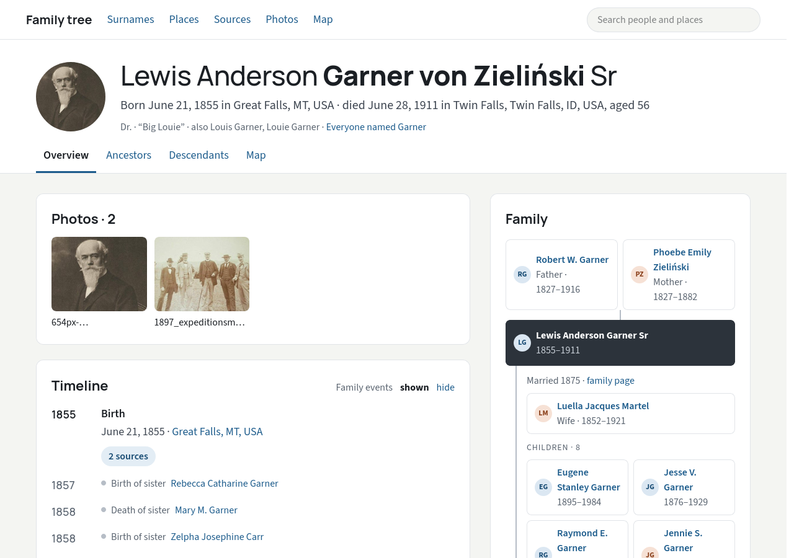
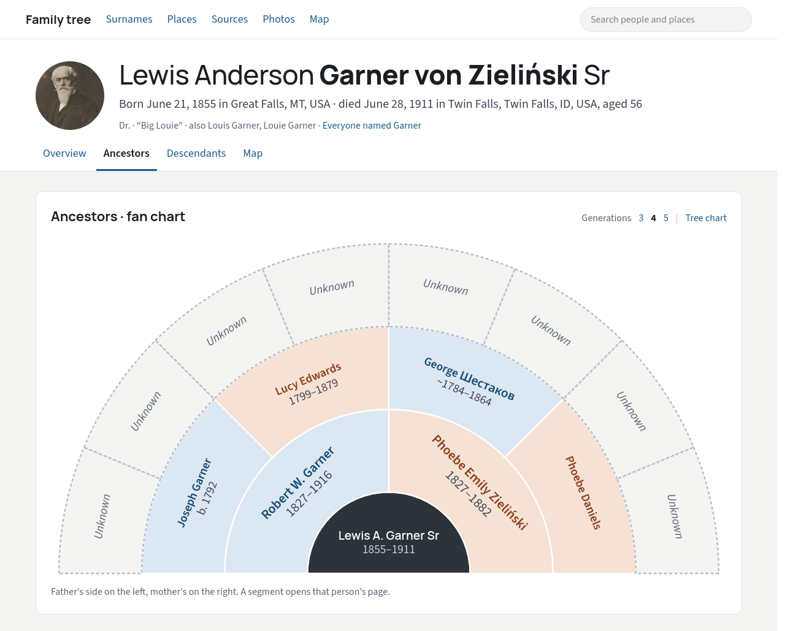
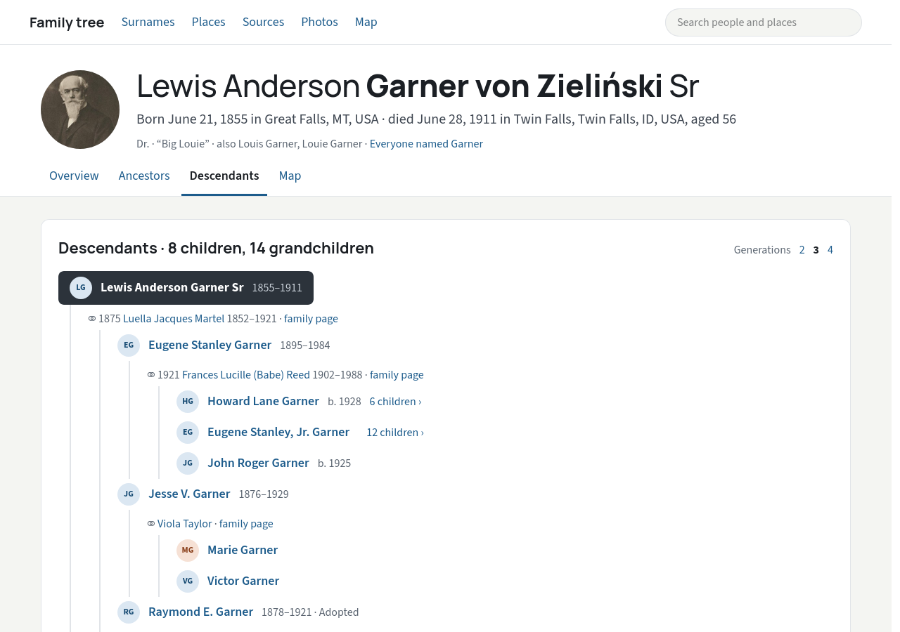
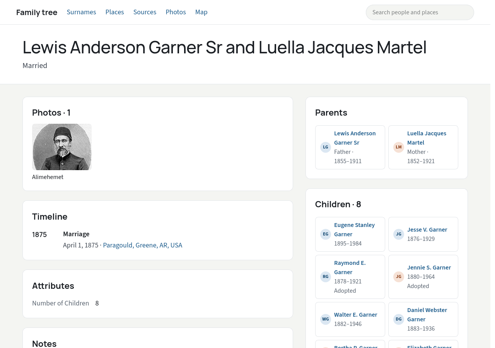

# Kwatern

Read-only web viewer for [Gramps](https://gramps-project.org) genealogy exports. Point it at a
Gramps XML export (`.gramps`) or package (`.gpkg`, with the media) and it serves the tree from memory as a
single native binary.

*Kwatern* is the old spelling of the Czech *kvatern*, a volume of the Bohemian land registers. Sales of estates,
marriage contracts and wills were entered in them, and each volume was named after its colour, such as the white or
the green kwatern. The project is not affiliated with Gramps.

Status: early development. It serves person, family, place and source pages with photos, ancestor and
descendant charts, maps, media pages, a surname index and a search. See [docs/NOTES.md](docs/NOTES.md) for
progress, decisions and open items.

## Screenshots

| | |
|---|---|
| [](docs/screenshots/person.png) | [](docs/screenshots/fan-chart.png) |
| [](docs/screenshots/descendants.png) | [](docs/screenshots/family.png) |

The screenshots show the fictional example tree of the Gramps project
([example.gramps](https://github.com/gramps-project/gramps/tree/v6.0.8/example/gramps), GPL-2.0-or-later)
with its public-domain photos from Wikimedia Commons.

## Why Kwatern

[Gramps](https://gramps-project.org) is a wonderful program: free, careful with sources and evidence, and able to
record almost anything a family history needs. Kwatern exists only because of it, and leaves all the research
and editing to it.

[Gramps Web](https://www.grampsweb.org) is the official way to take a Gramps tree online, and it is excellent.
It is a full application for working on the tree together: editing in the browser, several users with their
own permissions, synchronization with desktop Gramps, imports and exports, reports and more. If you want your
family to add to the tree, use it.

That breadth has a cost for a smaller need. Gramps Web runs as several containers (the web application, a
background worker and a message broker), and on a small VPS it needs tuning to fit in memory. If all you want
is to publish the tree you keep in desktop Gramps so relatives can browse it, Kwatern is the smaller tool for
that job:

- **One file to run.** A single native binary for Linux, no containers, no database, no runtime to install.
- **Small.** A tree of thousands of people runs in 60–160 MB of memory, so it fits on the cheapest VPS next to
  other services (see [Memory and size](#memory-and-size)).
- **Read-only.** Nothing on the site can change the tree, which leaves fewer things that can go wrong and
  fewer to secure. Gramps stays the one place where the tree is edited.
- **Always current.** Copy a new export over the old one and the site shows it, with no import step.

## Getting started

You keep working on the tree in Gramps as before; Kwatern only shows it on the web.

1. **Export the tree from Gramps:** *Family Trees → Export…*, then either *Gramps XML Package (family tree and
   media)*, which takes the photos along, or *Gramps XML (family tree)* if the photos stay where they are on
   this computer.
2. **Download Kwatern** for Linux (x64 or arm64) from the
   [releases](https://github.com/PetrHejl/kwatern/releases) and unpack it.
3. **Start it with the export** and open <http://localhost:8080> in a browser:

   ```sh
   ./kwatern family.gpkg
   ```

That is all. Each person gets a page with their timeline, photos, family, ancestor and descendant charts and
a map of the places they lived. There are pages for places and sources, a surname index and search. Pages come
in English, Czech, German or Slovak, following each visitor's browser.

**Sharing with the family.** Copy the program and the export to any small Linux server and put a web server with
HTTPS in front of it, e.g. Caddy with `reverse_proxy 127.0.0.1:8080`. When you export a new version from Gramps
and copy it over the old one, the site shows it within ten seconds, without a restart.

**Privacy is safe by default.** People who may still be alive appear only as "Living", and anything marked
private in Gramps stays out. To show more to relatives only, let them sign in (see [Signing in](#signing-in)).

## Memory and size

Both serving the Gramps example tree (2,157 people), measured on 2026-09-29 on a Linux PC. "After browsing" is
after opening 300 people: for Kwatern their pages, charts and maps, 1,500 pages in all; for Gramps Web the API
requests of their person pages.

| | Kwatern | Kwatern, `-Xmx96m` | Gramps Web 3.22, defaults | Gramps Web, tuned |
|---|---|---|---|---|
| Runs as | 1 process | 1 process | 3 containers: 8 web workers, Celery with 2 processes, Valkey | 3 containers: 2 web workers, Celery with 1 process, Valkey |
| Memory, idle | 101 MB | 67 MB | 1.7 GB | 570 MB |
| Memory, after browsing | 152 MB | 57 MB | 1.8 GB | 600 MB |
| Program size | 52 MB binary | 52 MB binary | 4.7 GB image | 4.7 GB image |

Kwatern loads the tree in about 150 ms. On a real export of 356 people and 598 photos it serves in 80 MB.
The memory is the resident set of the process for Kwatern and the sum of `docker stats` of the three containers
for Gramps Web, which also does much more (see [Why Kwatern](#why-kwatern)).

## Modules

- `gramps-xml` - parser and immutable model for Gramps XML (schema 1.7.x). No runtime dependencies.
- `gramps-core` - dates in all Gramps calendars, localized display and the privacy filter. Uses ICU4J.
- `image` - JPEG, PNG and GIF decoding and JPEG encoding for thumbnails, in plain Java. No runtime dependencies.
- `server` - the web application, built on the JDK's `jdk.httpserver`.

## Build

Requires JDK 25; native builds need GraalVM 25.

```sh
./gradlew test                                     # uses the Gramps example tree, downloaded on first run
./gradlew test -PgrampsFile=/path/to/family.gramps # also checks your own export (prints counts only)
./gradlew :server:installDist                      # JVM build in server/build/install/kwatern
GRAALVM_HOME=/path/to/graalvm ./gradlew :server:nativeCompile
```

## Run

```sh
server/build/native/nativeCompile/kwatern family.gramps --port 8080
server/build/native/nativeCompile/kwatern family.gramps --media-dir /srv/media   # where the photos are
server/build/native/nativeCompile/kwatern family.gramps --allow-media-anywhere   # your own tree, media anywhere
server/build/native/nativeCompile/kwatern family.gpkg                            # package: media extracted
server/build/native/nativeCompile/kwatern family.gramps --check                  # load, print summary, exit
server/build/native/nativeCompile/kwatern --help
```

When the export file changes, the server loads it again and serves the new version; `--reload=off` turns this
off.

Memory levels off at a few hundred MB (about 220 MB for a tree of 2,000 people on a 1 GB machine). On a small
VPS a heap limit keeps it lower, at the cost of slightly more garbage collection: `-Xmx128m`, or `-Xmx96m`
for trees of a few thousand people, runs in about 80–100 MB:

```sh
server/build/native/nativeCompile/kwatern -Xmx128m family.gramps
```

Maps load their images from OpenStreetMap in visitors' browsers; `--map=off` turns them off and
`--map-tiles` chooses another tile server.

By default people who may be alive appear only as "Living" and records marked private in Gramps are left
out. `--living=show` and `--private=show` publish them, for example on a site only family can reach;
the server then prints a warning at startup.

### Signing in

Family members can sign in to see more than the public, for example people who may be alive. With
`--access=members` everyone sees the public view and members who sign in see the members' view; with
`--access=private` only members who sign in see anything. `--members-living` and `--members-private` set what
the members' view shows (by default living people, but not records marked private).

```sh
kwatern passwd --users users.txt tereza     # add a member or change their password
kwatern family.gramps --access=members --users users.txt --secret-file session.key --behind-proxy
```

Removing a member's line from `users.txt` signs them out; the file is read again when it changes. Without
`--secret-file` members sign in again after each restart.

Signing out ends the session in that browser only. To end a member's sessions everywhere, for example after a
lost phone, set a new password with `kwatern passwd`. To sign everyone out, delete the `--secret-file` and
restart the server, which then makes a new key.

Passwords must not travel over plain HTTP. Put a reverse proxy with HTTPS in front of the server, such as
Caddy (`reverse_proxy 127.0.0.1:8080`) or nginx, keep the server on `127.0.0.1` and use `--behind-proxy`, so
that the visitor's address and HTTPS are taken from the proxy's `X-Forwarded-*` headers. The server refuses to
offer signing in on another address without `--behind-proxy`, unless `--allow-insecure-login` is given.

## License

AGPL-3.0-or-later, see [LICENSE](LICENSE). The program includes third-party software under its own licenses,
listed in [NOTICE.txt](server/src/main/resources/me/hejl/kwatern/licenses/NOTICE.txt);
`kwatern --licenses` prints them all, so every copy of the program carries them. If you serve a changed
version, the AGPL asks you to offer its source to visitors: `--source-url` links to it from every page.
